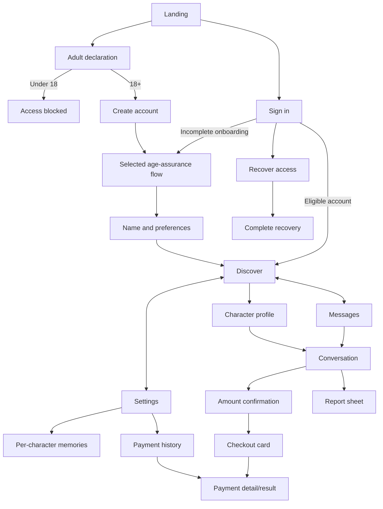

# Stage 0 — Product and frontend planning

Completed: 8 October 2026 (Africa/Lagos). Scope: planning artifacts only; no application implementation or backend integration.

Sources: [implementation plan](../implementation-plan.md), [design system](../design-system.md), and TalkingStage PRD v1.0. Use the frontend-design skill for every frontend design implementation; this continuing user instruction is also recorded in the root `AGENTS.md`.

## Deliverables

- This document: decisions, navigation, complete screen/state inventory, and P0 coverage.
- [Mock contracts](./mock-contracts.md): entity shapes, operations, state machines, isolation, and failure semantics.
- [Character fixtures](./characters.json): eight provisional profiles, personality samples, and owned image slots. These are data specifications, not application code or published assets.
- [Review scenarios](./review-scenarios.md): acceptance walkthroughs and evidence to collect in frontend stages.
- [Completion record](../reviews/stage-0.md): validation, limitations, and handoff.

Planning completion does not mean founder approvals, reviewed images, or provider choices are complete. Those dependencies remain explicit below; they do not block reusable foundation work in Stage 1.

## 1. Design plan and critique

Subject: Nigerian adults browsing fictional AI characters and continuing private conversations. Discovery's job is to help someone select a personality, not imply a mutual human match.

Palette: mist `#FAF8FA`, white `#FFFFFF`, charcoal plum `#241C23`, muted grape `#716570`, deep plum `#682447`, rose wash `#F5EAF0`. Typography: DM Serif Display for restrained page/profile headings; Manrope for the interface, chat, and tabular payment numerals. Layout: one portrait-led discovery column on mobile, with three labelled app destinations and a dedicated chat viewport. Signature: a character-specific conversation clue under each portrait.

Critique: A generic swipe deck and heart badges would obscure useful profile details and imply real matching. The chosen feed gives the clue, bio, adult age, and AI identity room to be read. Serif headings are retained only at key hierarchy points; dense cards, chat, and money interfaces use the body face. No extra accent palette, fictitious online indicators, or activity animation is introduced.

## 2. Decision register

Status vocabulary: **Confirmed** = user instruction or agreed PRD launch requirement; **Provisional** = a reversible planning choice, not founder approval; **Open** = must be selected/reviewed before its dependency gate.

| ID | Decision | Status/source | Current specification | Deadline |
| --- | --- | --- | --- | --- |
| D01 | Delivery order | Confirmed, user | Entire frontend, including admin, before backend | All stages |
| D02 | Design practice | Confirmed, user | Always apply frontend-design for frontend design implementation | All frontend work |
| D03 | Product boundary | Confirmed, PRD | Nigerian adults; fictional operator-created cast; non-explicit launch | All stages |
| D04 | Design direction | Confirmed style, provisional specific tokens | Professional, minimal, modern, mobile-first; implement current design system as starting direction | Review in Stage 1; final by 7 |
| D05 | Cast | Provisional | Eight profiles, four women/four men, ages 25–34; JSON in this folder | Founder approval by 7 |
| D06 | Portraits and gallery | Open | Per-character image slots only; no real images yet, none reviewed or published | Required approved presentation by 7; publication controls by 9 |
| D07 | Navigation | Provisional | Public/account/onboarding/user/admin maps below | Refine by 7 |
| D08 | Language choices | Provisional labels, PRD capability | English; English with Pidgin. UI remains plain English; character responses use preference | Stage 2 |
| D09 | Gender preferences | Provisional labels | Women, men, or both; editable; no inferred orientation | Stage 2 |
| D10 | Account method | Open, prototype email/password | Mock register/sign-in/recovery; no credentials persisted; adapt if selected provider changes UI | Screen choice by 7; service by 8 |
| D11 | Age assurance | Open | Declaration plus reserved assurance screen/states; no assumed provider or identity documents | Selected method/screens by 7; enforcement by 8 |
| D12 | Memory | Provisional semantics; retention open | Separate facts and relationship state; inspect/delete/disable; sensitive facts not saved automatically | Semantics by 5; policy by 7 |
| D13 | Conversation actions | Confirmed by user during Stage 5 | Archive preserves chat; delete removes chat/summary; reset clears chat/summary and restarts relationship state. Both keep memories by default with an explicit unchecked option to clear that character’s memories. Payment history remains. | Implemented in Stage 5; enforce durably in backend |
| D14 | Account deletion | Open policy | Remove personal account/chat/memory data; retained payment records explained; retention duration not invented | Screen copy by 7; review by 13 |
| D15 | Monetary requests | Confirmed optionality; limits open | Decline/mute available; no early-chat requests, repeated pressure, or affection changes | Exact rules by 7; enforcement by 11 |
| D16 | Amounts | Open limits; provisional example | NGN integer minor units; ₦5,000 is a scenario value, never a fixed request amount or product minimum | Limits by 7; integration by 11 |
| D17 | Gateway and merchant | Open | Gateway-neutral simulated checkout; operator receives payments | Extra UI by 7 if required; approval by 11 |
| D18 | Chat access/budget | Open | Free limited pilot proposed; explicit limit/paused states; no subscription flow | UI by 7; enforcement by 10 |
| D19 | Model and services | Open | Replaceable adapters; no provider selected or integrated in frontend | Relevant Stages 8–12 |
| D20 | Refund/dispute | Open final semantics | Distinct UI states; no affection penalty; ledger stays source of truth | Presentation by 7; verification by 11 |
| D21 | Policies/support/domain | Open | Draft policy layouts; no fabricated support address, domain ownership, or compliance statement | Layout by 7; reviewed content by 13 |

The product owner owns unresolved business choices. Implementation may proceed on labelled provisional fixtures; founder sign-off is not inferred from silence. Stage 7 cannot pass with unresolved screen-changing dependencies.

## 3. Navigation map

Route names are proposed frontend destinations, not implemented pages or API paths. Character and conversation IDs are stable opaque identifiers; page access depends on session/age state later enforced server-side.

- Public: landing, sign-in, registration entry, age declaration/blocked, recovery, terms, privacy, payment information, support.
- Onboarding: assurance, assurance pending/failed, name and preferences, disclosures/completion. Resume incomplete steps after sign-in; do not redirect unfinished accounts straight to discovery.
- User shell: Discover, Messages, Settings. Settings contains memories, payment history, request controls, preferences, account/privacy actions.
- Chat shell: back to Messages or originating profile, character identity, menu, composer; no competing bottom navigation. Menu includes memories, report, monetary-request controls, archive/delete/reset.
- Admin shell: Overview, Cast, Assets, Reports, Payments, Operations, Audit. Separate role-dependent navigation; no admin role inferred from a URL.
- Signed-out or expired sessions: sign-in with a safe internal return destination. Never accept an arbitrary external redirect target. Underage/blocked accounts cannot navigate past onboarding gates in prototype scenarios.

## 4. Screen and state inventory

All asynchronous screens support initial loading, failure/retry, and offline feedback where meaningful. All submissions preserve input, disable accidental resubmission while pending, and provide explicit validation errors. Shared not-found, forbidden, expired-session, and maintenance states are required. Empty states provide a next action rather than an indefinite loader.

| ID | Proposed destination | Screen/modal and required specific states | Stage |
| --- | --- | --- | --- |
| S01 | `/` | Landing; portrait loading/failure; AI/adult disclosure; entry/sign-in | 2 |
| S02 | `/onboarding/age` | Adult declaration, no choice, adult, underage blocked | 2 |
| S03 | `/register` | Account form; invalid input, mock duplicate/unavailable, submit/success | 2 |
| S04 | `/sign-in` | Credentials; invalid, pending, expired session, incomplete onboarding | 2 |
| S05 | `/recover` | Recovery form; non-enumerating sent response, failed send/retry | 2 |
| S06 | `/recover/complete` | Recovery completion; invalid/expired reference, success | 2 |
| S07 | `/onboarding/assurance` | Method-dependent assurance; not started/pending/approved/failed/blocked; unresolved method explicitly flagged in review | 2 |
| S08 | `/onboarding/preferences` | Name, gender preferences, language; invalid/unsaved/saved | 2 |
| S09 | `/onboarding/complete` | AI disclosure and completion; required step missing | 2 |
| S10 | `/terms`, `/privacy`, `/payment-information`, `/support` | Four public information layouts; draft content label; no fake legal/support claims | 2 |
| S11 | `/discover` | Active cards; gender/personality/interest filter sheet; reset, no results, no active cast | 3 |
| S12 | `/characters/[characterId]` | Profile/gallery/viewer; missing, deactivated, broken image, start/resume chat | 3 |
| S13 | `/messages` | Active/archive lists; empty, unread/read, row menu, missing latest preview | 4 |
| S14 | `/messages/[conversationId]` | Intro/existing chat; sending, saved, failed delivery, reply pending/failed/interrupted, offline, limits, paused, unavailable character | 4 |
| S15 | Chat photo/viewer | Caption, load/reload, unavailable asset, paused photos, gallery close/focus restore | 4 |
| S16 | `/settings` and `/settings/preferences` | Groups/preferences; changed, saving, failed, saved; sign-out confirmation if needed | 5 |
| S17 | `/settings/memories` and character detail | Memory list; none, disabled, inspect/source, delete confirmation, sensitive-save consent | 5 |
| S18 | Chat/settings action sheets | Archive, unarchive, delete, reset; consequences and optional memory-clear choice | 5 |
| S19 | `/settings/requests` | Monetary-request toggle; enabled/disabled/save failure; chat decline/ignore | 5 |
| S20 | Chat amount confirmation | Missing/invalid amount, limits, NGN/recipient/purpose, confirm/not now, creating/failed | 5 |
| S21 | Chat payment card | Checkout available, pending, paid, failed, cancelled, expired, refunded, disputed; no real URL in prototype | 5 |
| S22 | `/payments/[paymentIntentId]` | Result/detail; verification pending, all lifecycle states, not found/forbidden | 5 |
| S23 | `/settings/payments` | History; empty, paging, amount/date/reference/status, detail navigation | 5 |
| S24 | Report sheet (profile/chat/photo) | Target preview, reason/details, validation, submitting/sent/failed | 5 |
| S25 | `/settings/account` | Delete account; consequences, confirm/cancel, pending/failed/deleted, retained-record explanation | 5 |
| S26 | `/admin` | Operational overview; no data/loading/error, forbidden | 6 |
| S27 | `/admin/characters` | List; draft/published/deactivated, paused capabilities, create/search | 6 |
| S28 | `/admin/characters/new`, `/admin/characters/[id]` | Edit/preview; required fields, adult age, instructions/version, publish/deactivate confirmations | 6 |
| S29 | `/admin/assets` and asset detail | Character filter, local upload preview, reviewing/approved/rejected, publish eligibility/mismatch | 6 |
| S30 | `/admin/reports` and report detail | Queue, relevant context, review/resolve, missing/deleted target | 6 |
| S31 | `/admin/payments` and payment detail | Ledger, intent/events, verification/reconciliation, refunds/disputes, paging | 6 |
| S32 | `/admin/operations` | Global/per-character chat/photo/payment switches; limits configuration, validation, pending/failed | 6 |
| S33 | `/admin/audit` | Actor/action/target/time, filters, paging; no sensitive content in list | 6 |
| S34 | Shared fallback destinations | Not found, forbidden, offline, session expired, maintenance; safe next action | 1–6 |
| S35 | Development-only preview | Components, fixture personas/scenarios, reset mock state; not shipped to production | 1 |

Sheets/viewers retain an accessible opening control and return focus on dismissal. Routes use semantic headings and one primary action. Portrait failures never replace one character with another.

## 5. P0 destination and backend ownership

Backend ownership below names the planned subsystem/stage, not a service already implemented. See the roadmap for full server acceptance requirements.

| Requirement | Frontend destinations | Backend owner |
| --- | --- | --- |
| AUTH-01 | S03–06, S16, S34 | Identity, Stage 8 |
| AGE-01 | S02, S07, S09, S12, S28–29 | Adult access 8; cast review 9 |
| PREF-01 | S08, S16 | Preferences 8 |
| DISC-01 | S11 | Cast reads 9 |
| DISC-02 | S11 | Cast filtering 9 |
| PROF-01 | S12 | Cast 9; conversation start 10 |
| CHAT-01 | S14 | Private persistence 10 |
| CHAT-02 | S12, S14, S28 | Character instructions/model evaluation 10 |
| CHAT-03 | S14 | Delivery/idempotency 10 |
| CHAT-04 | S13–14, S18 | Conversation lifecycle 10; deletion 12 |
| MEM-01 | S17 | Scoped context/memory 10 |
| MEM-02 | S17–18 | Consent/deletion 10, 12 |
| IMG-01 | S15, S29 | Asset checks 9; structured selection 10 |
| IMG-02 | S12, S15, S29 | Asset publication review 9 |
| PAY-01 | S19–20, S32 | Behaviour 10; policy enforcement 11 |
| PAY-02 | S20 | Confirmation/amount validation 11 |
| PAY-03 | S21 | Gateway intent creation 11 |
| PAY-04 | S21–22, S31 | Server verification 11 |
| PAY-05 | S21–22, S31 | Ledger/event idempotency 11 |
| PAY-06 | S23, S31 | Owned history/ledger 11 |
| PRIV-01 | S10, S18, S25 | Data deletion/retention 12 |
| REPORT-01 | S24, S30 | Reporting/review 12 |
| ADMIN-01 | S27–29 | Cast management 9 |
| ADMIN-02 | S26, S30–33 | Pauses 9; payments 11; reports/operations 12 |

## 6. Stage 1 handoff

Build tokens, primitives, shells, component/state preview, and typed mock adapters next. Use the contracts here as planning inputs, not a reason to create server endpoints. Install no provider SDK or database for this stage. Keep actual UI fixtures outside instruction/configuration content; never send admin-only instructions to user components in the later production implementation.

Characters and assets remain drafts. Image slots specify ownership and art direction only; generating, reviewing, and approving actual imagery remains later frontend work. Stage 0 has no screenshot evidence because no screens are implemented; the review matrix defines evidence to collect as those screens are built.
